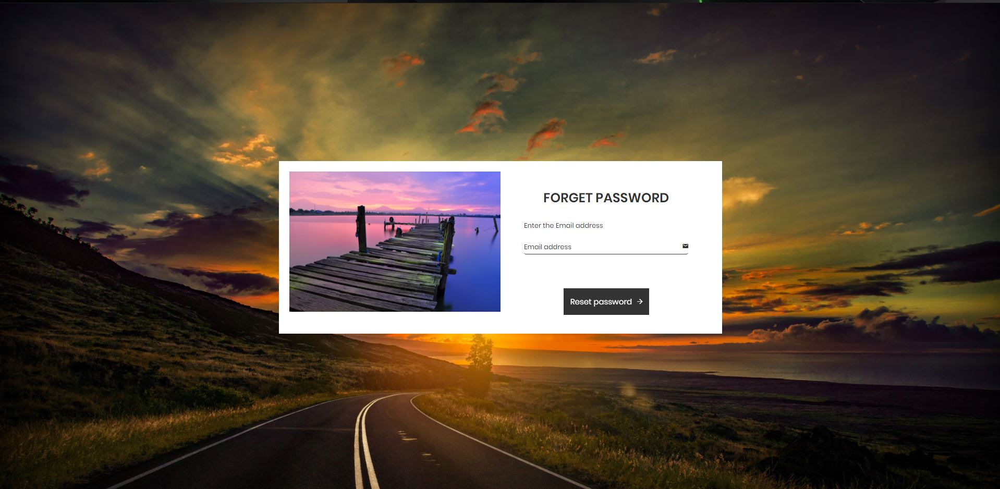

# Blog_firebase
## Images

## Additional Info
### Add the folder and paste both the blog folder and project folder into the project folder and outside only craete the new folder of node and place the app.js file into the node folder which must be created outside the as of project folder.
